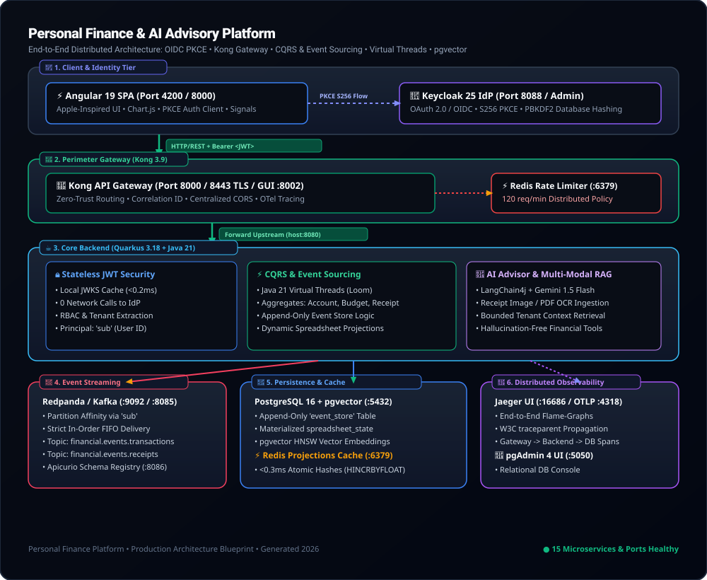
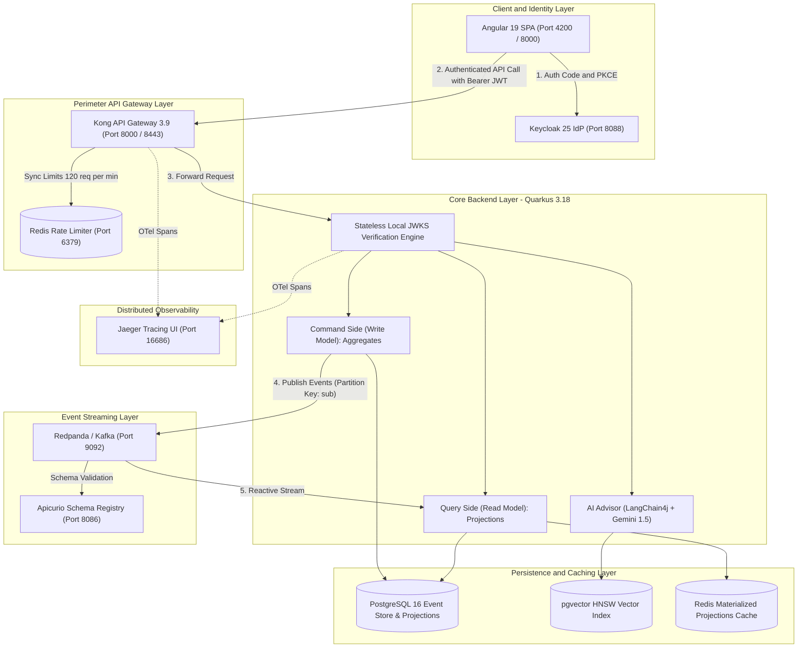

# Personal Finance & AI Advisory Platform

A distributed, enterprise-grade personal finance and AI advisory platform unifying manual spreadsheet entries, recurring expense catalogs, and asynchronous AI-extracted receipt data into a single immutable source of truth via **CQRS** and **Event Sourcing**, protected by **Keycloak OIDC PKCE** and **Kong API Gateway**, powered by **Java 21 Virtual Threads (Loom)** and **Autonomous Agentic RAG (LangChain4j + Google Gemini 1.5)**.

---

## 🏛️ System Architecture Blueprint



---

### 📊 Visual Flowchart



---

###  ASCII Architecture Map

```
┌─────────────────────────────────────────────────────────────────────────────────────────────┐
│ 📱 CLIENT & IDENTITY LAYER                                                                  │
│  • Angular 19 SPA (Port 4200 / 8000) <══[ OIDC PKCE S256 ]══> Keycloak 25 IdP (Port 8088)   │
└──────────────────────────────────────────────┬──────────────────────────────────────────────┘
                                               │ (Bearer JWT)
                                               ▼
┌─────────────────────────────────────────────────────────────────────────────────────────────┐
│ 🦍 PERIMETER API GATEWAY (Kong 3.9 DB-less - Port 8000 / 8443)                              │
│  • Redis Rate Limiter (120 req/min) • Correlation ID (X-Correlation-ID) • Centralized CORS  │
└──────────────────────────────────────────────┬──────────────────────────────────────────────┘
                                               │ (Internal Forward)
                                               ▼
┌─────────────────────────────────────────────────────────────────────────────────────────────┐
│ ☕ CORE BACKEND (Java 21 Quarkus 3.18 + Virtual Threads)                                    │
│  • Stateless Local JWKS JWT Verification (< 0.2ms)                                          │
│  • CQRS Command Aggregates: AccountAggregate, BudgetAggregate, ReceiptAggregate            │
│  • Reactive Query Projections: Spreadsheet, Metrics, Expense Catalog                        │
│  • AI Agentic RAG: LangChain4j + Gemini 1.5 Flash Multi-Modal Vision                        │
└──────────────────────┬───────────────────────┬───────────────────────────────┬──────────────┘
                       │ (Publish Events)      │ (Read/Write Projections)      │ (Vector RAG)
                       ▼                       ▼                               ▼
       ┌──────────────────────────────┐ ┌─────────────────────────────┐ ┌─────────────────────┐
       │ 🐼 EVENT STREAMING           │ │ 🐘 PERSISTENCE & CACHE      │ │ 🧠 VECTOR DATABASE  │
       │ • Redpanda Broker (Port 9092)│ │ • PostgreSQL 16 (Port 5432) │ │ • pgvector (HNSW)   │
       │ • Topics (Key: User 'sub')   │ │ • Redis Cache (Port 6379)   │ │ • Semantic Search   │
       │ • Apicurio Registry (:8086)  │ │ • Materialized Views        │ │ • Receipt OCR Items │
       └──────────────────────────────┘ └─────────────────────────────┘ └─────────────────────┘
                                               │
                                               ▼ (Distributed OTel Traces)
                               ┌──────────────────────────────────────────────┐
                               │ 🔭 DISTRIBUTED OBSERVABILITY                 │
                               │ • Jaeger UI (Port 16686 - OTLP 4318/4317)    │
                               └──────────────────────────────────────────────┘
```

---

## 🌐 Unified Service Directory & Access Endpoints

| Service | Local URL | Port | Protocol | Purpose & Credentials |
| :--- | :--- | :---: | :--- | :--- |
| **Kong HTTP Gateway** | **[http://localhost:8000](http://localhost:8000)** | `8000` | HTTP | **Primary unified public application entrypoint** |
| **Kong HTTPS Gateway** | **[https://localhost:8443](https://localhost:8443)** | `8443` | HTTPS | Encrypted perimeter gateway entrypoint |
| **Kong Manager GUI** | **[http://localhost:8002](http://localhost:8002)** | `8002` | HTTP | Kong Gateway administration & analytics dashboard |
| **Kong Admin API** | **`http://localhost:8001`** | `8001` | HTTP (Private) | Declarative Gateway configuration & status inspection |
| **Keycloak IdP & Admin** | **[http://localhost:8088/admin](http://localhost:8088/admin)** | `8088` | HTTP | OpenID Connect server & user management (`admin` / `admin`) |
| **Angular Frontend SPA** | **[http://localhost:4200](http://localhost:4200)** | `4200` | HTTP | Single Page App (Spreadsheet, Analytics, AI Advisor) |
| **Quarkus Backend Core** | **`http://localhost:8080`** | `8080` | HTTP | Java 21 CQRS & Event Sourcing core engine |
| **Quarkus Swagger / OpenAPI** | **[http://localhost:8080/q/swagger-ui](http://localhost:8080/q/swagger-ui)** | `8080` | HTTP | Interactive REST API documentation |
| **Redpanda Console** | **[http://localhost:8085](http://localhost:8085)** | `8085` | HTTP | Kafka topics, message inspector & partition monitor |
| **Redpanda Broker** | **`localhost:9092`** | `9092` | TCP (Kafka) | High-throughput distributed event streaming broker |
| **Apicurio Schema Registry** | **[http://localhost:8086](http://localhost:8086)** | `8086` | HTTP | Apache Avro event schema governance |
| **Jaeger Distributed Tracing** | **[http://localhost:16686](http://localhost:16686)** | `16686` | HTTP | End-to-end request flame-graphs & latency spans |
| **PostgreSQL + pgvector** | **`localhost:5432`** | `5432` | TCP (Postgres) | Event Store, Projections & Vector DB (`pf_user` / `pf_password`) |
| **pgAdmin 4 Database UI** | **[http://localhost:5050](http://localhost:5050)** | `5050` | HTTP | PostgreSQL web console (`admin@admin.com` / `admin`) |
| **Redis In-Memory Store** | **`localhost:6379`** | `6379` | TCP (RESP) | Distributed rate limiter & projection cache |

---

## 🧩 Architectural Concepts & Core Responsibilities

### 1. Identity & Access Management (Keycloak 25 + OIDC PKCE)
- **RFC 7636 PKCE Authorization Code Flow**: The Angular frontend generates dynamic SHA-256 `code_challenge` proofs. The client application never touches, sees, or processes user passwords.
- **Database Persistence**: User credentials are encrypted with PBKDF2 (27,500 iterations) inside Keycloak's PostgreSQL database.
- **Zero-Trust Token Contract**: JWTs contain `sub` (User ID), `tenant_id`, and `realm_access.roles` (`admin`, `user`, `financial-planner`).

### 2. Perimeter Security & API Gateway (Kong 3.9 DB-less)
- **Declarative GitOps Config**: Kong runs in DB-less mode configured via `docker/kong/kong.yml`.
- **Distributed Redis Rate Limiting**: Enforces a strict 120 req/min limit per client. Exceeded requests receive `HTTP 429` at the perimeter without touching Java or PostgreSQL.
- **Correlation ID Injection**: Injects unique `X-Correlation-ID` headers to correlate logs and traces across all services.
- **Centralized CORS & TLS**: Resolves browser preflight `OPTIONS` requests in `<1ms`.

### 3. Stateless Cryptographic JWKS Verification (Quarkus 3.18)
- Quarkus caches Keycloak’s public RSA keys (JWKS) locally in memory.
- Incoming JWT signatures are verified in **< 0.2 milliseconds in CPU RAM**, eliminating network calls to Keycloak on every request.

### 4. High-Concurrency Concurrency Engine (Java 21 Virtual Threads)
- All controllers and event handlers execute on lightweight **Java 21 Virtual Threads (`@RunOnVirtualThread`)**.
- While waiting for database I/O, Redis lookups, or Gemini LLM responses, virtual threads unmount from OS carrier threads, allowing tens of thousands of concurrent operations per server.

### 5. CQRS & Event Sourcing
- **Command Side (Write)**: Domain Aggregates (`AccountAggregate`, `BudgetAggregate`, `ReceiptAggregate`) validate business rules and append immutable events to the `event_store` table.
- **Query Side (Read)**: Projections consume the event stream and maintain denormalized, ready-to-read tables (`spreadsheet_state`, `monthly_metrics`, `expense_catalog`).
- **Complete Auditability**: Replay historical events to reconstruct exact point-in-time state at any past date.

### 6. Event Streaming & Partition Affinity (Redpanda)
- Emits events across Redpanda topics (`financial.events.transactions`, `financial.events.receipts`, `financial.events.alerts`).
- **Deterministic Key Hashing**: Events use `tenant_id` / `sub` as the Kafka Message Key. `MurmurHash2(Key)` guarantees that all events for a given user land on the same partition for **strict FIFO in-order delivery**.

### 7. Multi-Modal Vision & Agentic RAG (Gemini 1.5 + pgvector)
- **Multi-Modal Receipt OCR**: Ingests images and PDFs, extracting merchant name, purchase date, line items, and totals via Google Gemini 1.5 Flash.
- **Vector Search**: Computes embeddings stored in PostgreSQL `pgvector` using an HNSW index, partitioned by `tenant_id`.

### 8. Distributed Caching & Projections (Redis 7.2)
- Caches pre-aggregated monthly balances and category spending in Redis Hashes (`HINCRBYFLOAT`), delivering **< 0.3 millisecond read latencies**.

### 9. Distributed Observability & Telemetry (OpenTelemetry + Jaeger)
- Traces requests from Kong Gateway through Java Virtual Threads to PostgreSQL, exporting W3C `traceparent` spans to Jaeger.

### 10. Apple-Inspired Human Interface UX (Angular 19 Standalone)
- 56px minimalist header, segmented navigation pills (`[ 📊 Planilha | 📈 Gráficos | ✨ AI Advisor ]`), floating frosted glass popovers for Capital de Giro, Chart.js financial charts, and reactive signals.

---

## 📂 Project Structure

```
├── Makefile                            # One-command orchestration (make start, make test, make status)
├── docker-compose.yml                  # Infrastructure stack (Kong, Keycloak, Postgres, Redis, Redpanda, Jaeger)
├── docker/
│   ├── kong/
│   │   └── kong.yml                    # Declarative Kong Gateway 3.9 config & 5 active plugins
│   ├── keycloak/
│   │   └── realm-export.json           # Keycloak realm, OIDC clients, PKCE, roles & claim mappers
│   └── init-db.sql                     # PostgreSQL schema, Event Store, pgvector & read tables
├── backend/                            # Java 21 Quarkus CQRS & Event Sourcing Backend
│   ├── pom.xml                         # Quarkus dependencies (OIDC, Kafka, Redis, pgvector, OpenTelemetry)
│   ├── src/main/resources/
│   │   ├── application.properties      # JWKS caching, Virtual Threads, Kafka, Redis & OTel config
│   │   └── avro/                       # Apache Avro schema contracts
│   └── src/main/java/com/personalfinance/
│       ├── domain/                     # Aggregate Roots (Account, Receipt, Budget) & Domain Events
│       ├── infrastructure/             # PostgresEventStore, RedisRepository, PgVector, Outbox Publisher
│       ├── projection/                 # Event consumers & materialized view projectors
│       ├── ai/                         # LangChain4j + Gemini 1.5 RAG Advisor & OCR Extraction
│       └── api/                        # REST Resources (Spreadsheet, Commands, Queries, Audit)
├── frontend/                           # Angular 19 Standalone SPA
│   ├── proxy.conf.json                 # Dev server proxy routing /api/* to Kong Gateway (Port 8000)
│   ├── src/app/
│   │   ├── core/                       # AuthService (PKCE), Interceptors, Guards, State Store
│   │   ├── features/                   # Spreadsheet (Excel UI), Analytics, Advisor, Login
│   │   └── shared/                     # Apple-style Navbar & Popover menus
└── scripts/                            # Operational automation scripts
    ├── start.sh                        # Full stack bootstrap script
    ├── stop.sh                         # Graceful teardown script
    ├── seed.sh                         # Realistic financial test scenario generator
    ├── lan-info.sh                     # LAN IP and device access helper
    ├── backup-db.sh                    # Automated PostgreSQL database backup
    └── restore-db.sh                   # Automated PostgreSQL database restore
```

---

## 🚀 Getting Started

### Prerequisites
- **Docker / OrbStack**
- **Java 21+** (JDK 21 or JDK 26)
- **Node.js 20+** & **npm**

---

### 1. Start the Entire Platform

```bash
make start
```
*Starts Docker infrastructure (Kong, Keycloak, PostgreSQL, Redis, Redpanda, Jaeger, Apicurio, pgAdmin), Java Quarkus backend, and Angular frontend.*

---

### 2. Verify System Status

```bash
make status
```
*Or check the API Gateway status specifically:*
```bash
make gateway-status
```

---

### 3. Run Automated Test Suites

```bash
make test
```
*Executes all backend domain aggregate, event sourcing, vector embedding, and frontend TypeScript tests.*

---

### 4. Seed Test Financial Data

```bash
make seed
```

---

### 5. Stop the Platform

```bash
make stop
```

---

## 📜 Makefile Command Reference

| Command | Action |
| :--- | :--- |
| **`make start`** | Starts all containers, Quarkus backend, and Angular frontend. |
| **`make stop`** | Gracefully stops all application processes and containers. |
| **`make status`** | Displays health and port status of all microservices. |
| **`make test`** | Runs backend Maven unit tests and frontend TypeScript checks. |
| **`make gateway`** | Starts the Kong API Gateway service specifically. |
| **`make gateway-logs`** | Streams real-time traffic logs passing through Kong Gateway. |
| **`make gateway-status`**| Queries Kong Admin API for memory and route health. |
| **`make seed`** | Ingests realistic financial test transactions, receipts, and budgets. |
| **`make backup-db`** | Creates an automated timestamped backup of the PostgreSQL database. |
| **`make restore-db`** | Restores the PostgreSQL database from the latest backup snapshot. |
| **`make lan-info`** | Shows LAN IP address and ports for mobile/tablet testing. |
