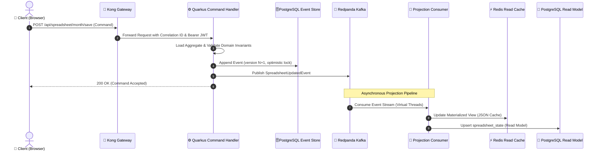
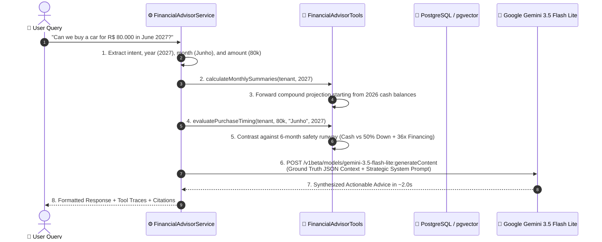
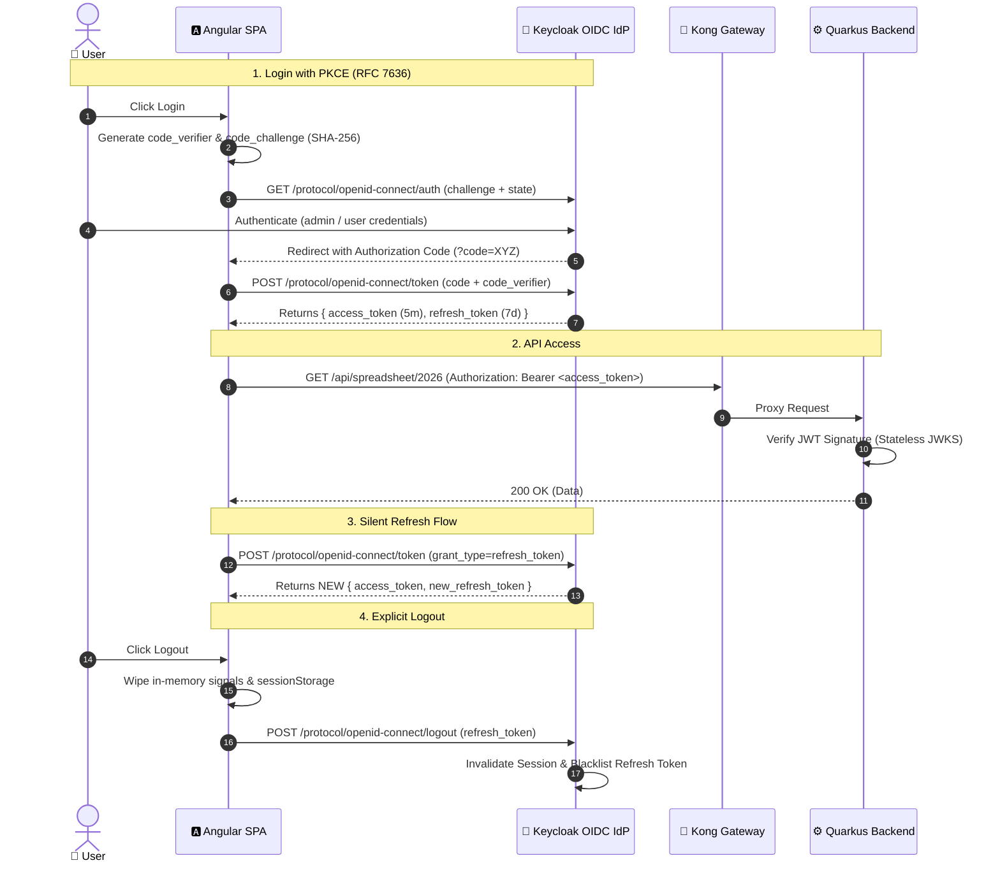

# System Design: Personal Finance & AI Advisory Platform

---

## 1. Executive Summary & Architectural Vision

The **Personal Finance & AI Advisory Platform** is a distributed, reactive, enterprise-grade wealth management and financial intelligence system. It combines **CQRS (Command Query Responsibility Segregation)**, **Event Sourcing**, **Zero-Trust Identity (Keycloak OIDC PKCE)**, **Perimeter Gateway Security (Kong API Gateway)**, **Event Streaming (Redpanda / Kafka)**, and **Autonomous Agentic RAG (Google Gemini 3.5 Flash Lite + pgvector)**.

The system is fully containerized with **two load-balanced Java Quarkus backend nodes**, an **Angular 19 SPA served via Nginx**, and dedicated infrastructure for event sourcing, caching, telemetry, and vector similarity search.

---

## 2. High-Level Architecture Diagram (C4 Container View)

```mermaid
graph TD
    User["👤 User / Browser"]
    
    subgraph GatewayTier ["Perimeter Gateway Layer (Port 8000 / 8443)"]
        Kong["🦍 Kong API Gateway 3.9<br/>• Upstream Load Balancer (Round-Robin)<br/>• Redis Rate Limiter (120 req/min)<br/>• OpenTelemetry Tracer<br/>• Correlation ID Injection<br/>• CORS Termination"]
    end

    subgraph ClientTier ["Client Presentation Layer"]
        Frontend["🅰️ Angular 19 SPA (Nginx 1.27 Alpine)<br/>• Reactive Signals State<br/>• PKCE Crypto Client<br/>• Tailwind CSS Dark Theme<br/>• Chart.js Visualizations"]
    end

    subgraph IdentityTier ["Identity & Access Management (Port 8088)"]
        Keycloak["🔐 Keycloak 25 OIDC IdP<br/>• Authorization Code Flow with PKCE<br/>• Refresh Token Rotation (RTR)<br/>• Session Revocation / Logout<br/>• Realm Role & Tenant Claims"]
    end

    subgraph BackendTier ["Core Backend Services (Quarkus 3.18 / Java 21)"]
        Upstream["Kong Upstream: backend-upstream"]
        Backend1["⚙️ pf-backend-1 (Port 8080)<br/>• Java 21 Virtual Threads (Loom)<br/>• Command Aggregates (Write)<br/>• Projection Engine (Read)<br/>• AI Advisor RAG Service"]
        Backend2["⚙️ pf-backend-2 (Port 8083)<br/>• Java 21 Virtual Threads (Loom)<br/>• Command Aggregates (Write)<br/>• Projection Engine (Read)<br/>• AI Advisor RAG Service"]
    end

    subgraph StreamingTier ["Event Streaming & Schema Governance"]
        Redpanda["🐼 Redpanda Kafka 24.1 (Port 9092)<br/>• Topics: transactions, spreadsheet, alerts"]
        Apicurio["📜 Apicurio Schema Registry (Port 8086)<br/>• Strict Avro Schema Contracts"]
        RedpandaConsole["📊 Redpanda Console (Port 8085)<br/>• Message Visualizer & Stream Inspector"]
    end

    subgraph PersistenceTier ["Persistence, Caching & Vector Store"]
        Postgres[("🐘 PostgreSQL 16 + pgvector (Port 5432)<br/>• Immutable Event Store<br/>• Materialized Spreadsheet State<br/>• HNSW Vector Similarity Index")]
        Redis[("⚡ Redis 7.2 Alpine (Port 6379)<br/>• Sub-millisecond Materialized Views<br/>• Kong Distributed Rate Limiter")]
        PgAdmin["🐘 pgAdmin 4 (Port 5050)<br/>• Database Administration UI"]
    end

    subgraph AITier ["Artificial Intelligence & Strategic Advisory"]
        Gemini["🤖 Google Gemini 3.5 Flash Lite API<br/>• Direct HTTP/2 REST Integration<br/>• ~1.5s–2.5s Latency<br/>• Multi-Year Forward Projections (2026–2030+)"]
    end

    subgraph TelemetryTier ["Observability & Distributed Tracing"]
        Jaeger["🔍 Jaeger All-in-One (Port 16686 / 4317 / 4318)<br/>• End-to-End Distributed Tracing<br/>• W3C Trace Context Propagation"]
    end

    %% Interactions
    User -->|1. HTTP Requests (Port 8000)| Kong
    User -->|2. OIDC Login / PKCE (Port 8088)| Keycloak
    Kong -->|Static Web Traffic: / | Frontend
    Kong -->|API Traffic: /api/* | Upstream
    Upstream -->|Weight 100| Backend1
    Upstream -->|Weight 100| Backend2

    Backend1 & Backend2 -->|Stateless JWT Validation| Keycloak
    Backend1 & Backend2 -->|Append Events (Write Model)| Postgres
    Backend1 & Backend2 -->|Publish Events| Redpanda
    Redpanda -->|Validate Avro Schema| Apicurio
    Redpanda -->|Consume Events (Read Model)| Backend1 & Backend2
    Backend1 & Backend2 -->|Update Projections| Redis
    Backend1 & Backend2 -->|Update Projections| Postgres
    Backend1 & Backend2 -->|Semantic History Search| Postgres
    Backend1 & Backend2 -->|Ground Truth RAG Prompt| Gemini
    
    Kong -.->|Sync Rate Limits| Redis
    Kong -.->|Trace Export (HTTP)| Jaeger
    Backend1 & Backend2 -.->|Trace Export (gRPC)| Jaeger
    Redpanda -.->|Telemetry| RedpandaConsole
    Postgres -.->|DB Management| PgAdmin
```

---

## 3. Core Architectural Patterns

### A. CQRS (Command Query Responsibility Segregation) & Event Sourcing
* **Write Path (Command Side):**
  1. Requests modify aggregates (`SpreadsheetAggregate`, `AccountAggregate`, `ReceiptAggregate`).
  2. The aggregate executes business rules, checks invariant constraints, and generates domain events (e.g. `TransactionCreatedEvent`, `SpreadsheetUpdatedEvent`).
  3. Events are appended atomically to the immutable `events` table in PostgreSQL with sequential version numbers (`optimistic locking`).
  4. Events are published to Kafka/Redpanda partitions keyed by `tenantId` / `userId`.
* **Read Path (Query Side):**
  1. Asynchronous Kafka consumers (`SpreadsheetProjectionService`, `TransactionProjectionService`) listen to event topics.
  2. Events update low-latency read models in **Redis** (sub-millisecond lookups) and **PostgreSQL** (`spreadsheet_state`).
  3. Query APIs read directly from the optimized materialized views without executing joins or rebuilding state from scratch.



---

### B. Autonomous Agentic RAG & Financial Advisory Engine
Unlike generic chatbots that hallucinate financial calculations, the AI Advisor implements a **Deterministic Tool-Augmented RAG Engine**:



---

## 4. Layer-by-Layer Specifications

### 1. Perimeter API Gateway Layer ([`pf-kong`](../docker/kong/kong.yml))
* **Image:** `kong:3.9` (DB-less declarative mode).
* **Upstream Load Balancing:** Round-robin distribution between `backend-1:8080` and `backend-2:8080` with active HTTP health checks (`/q/health/live`).
* **Plugins Enabled:**
  * `rate-limiting`: 120 requests/minute per client IP (Redis-backed).
  * `correlation-id`: Generates unique `X-Correlation-ID` UUID per request.
  * `cors`: Cross-Origin Resource Sharing with allowed methods and headers.
  * `opentelemetry`: Exports W3C trace spans to Jaeger at `http://jaeger:4318/v1/traces`.
  * `request-transformer`: Injects security headers (`X-Forwarded-By: Kong-API-Gateway`).

### 2. Client Presentation Layer ([`pf-frontend`](../frontend/Dockerfile))
* **Framework:** Angular 19 Single Page Application.
* **Server:** Nginx 1.27 Alpine with Gzip compression and client-side SPA routing (`try_files $uri $uri/ /index.html`).
* **State Management:** Reactive Signals (`accessToken`, `refreshToken`, `currentUser`, `yearsData`).
* **Security Client:** RFC 7636 PKCE (SHA-256 Code Challenge) directly integrated with Keycloak OIDC.

### 3. Core Application Layer ([`pf-backend-1`](../backend/Dockerfile) & `pf-backend-2`)
* **Framework:** Quarkus 3.18.2 on Java 21 (Eclipse Temurin JRE Alpine).
* **Concurrency:** Java 21 Virtual Threads (Project Loom) for non-blocking execution across Kafka consumers and REST handlers.
* **Stateless Token Verification:** Validates Keycloak JWTs locally using Keycloak's JWKS public keys without network round-trips.

### 4. Messaging & Streaming Layer (`pf-redpanda` & `pf-apicurio`)
* **Message Broker:** Redpanda v24.1.8 (C++ Kafka-compatible engine, low resource footprint).
* **Schema Governance:** Apicurio Schema Registry v2.5 with Avro validation.
* **Key Topics:**
  * `financial.events.spreadsheet`: Spreadsheets, monthly entries, and cash adjustments.
  * `financial.events.transactions`: Individual income and expense entries.
  * `financial.events.alerts`: Real-time budget and runway warning events.

### 5. Persistence & Vector Layer (`pf-postgres` & `pf-redis`)
* **Primary Database:** PostgreSQL 16 with `pgvector` extension.
  * `events`: Append-only event store with aggregate ID, version, and JSON payload.
  * `spreadsheet_state`: Materialized snapshot table per tenant and year.
  * `embeddings`: HNSW vector index for semantic similarity search over financial history.
* **In-Memory Cache:** Redis 7.2 Alpine for sub-millisecond materialized view lookups.

### 6. Observability Layer (`pf-jaeger`)
* **Tracing Engine:** Jaeger 1.54 with OpenTelemetry OTLP receivers (gRPC: `4317`, HTTP: `4318`).
* **Distributed Tracing:** Traces originate at Kong, propagate across Quarkus virtual threads, Kafka headers, and database operations.

---

## 5. Security & Authentication Architecture (OIDC PKCE + Refresh Token Rotation)



---

## 6. Multi-Year Financial & Projection Engine Matrix

The system tracks and projects financial health across three distinct horizons:

| Metric | Short-Term (Current Month) | Mid-Term (Annual 2026) | Long-Term (Projections 2027–2030+) |
| :--- | :--- | :--- | :--- |
| **Data Source** | Live PostgreSQL records | Full 12-month spreadsheet state | Compound forward projection model |
| **Working Capital** | Monthly residual capital de giro | Dynamic month-by-month carryover | Preserves target buffer (R$ 16k cap) |
| **Emergency Reserve** | Current month Caixa Final | Cumulative end-of-year Caixa Final | Compound reserve growth + 13th salary |
| **Runway Analysis** | $\frac{\text{Caixa Final}}{\text{Gastos do Mês}}$ | Average annual burn rate | Inflation-adjusted burn rate |
| **Purchase Simulator** | Single-item cashflow test | Year-end 13th salary optimization | Down payment (30%–50%) + 24x/36x financing |

---

## 7. Container Deployment Matrix

| Container Name | Service | Base Image | Internal Port | Host Port | Purpose |
| :--- | :--- | :--- | :--- | :--- | :--- |
| `pf-kong` | `kong` | `kong:3.9` | 8000, 8001, 8002 | `8000`, `8001`, `8002`, `8443` | API Gateway & Load Balancer |
| `pf-frontend` | `frontend` | `nginx:1.27-alpine` | 80 | via Kong (`8000`) | Angular 19 SPA Web Server |
| `pf-backend-1` | `backend-1` | `eclipse-temurin:21-jre-alpine` | 8080 | `8080` (Direct) / `8000` (Kong) | Core Quarkus Node 1 |
| `pf-backend-2` | `backend-2` | `eclipse-temurin:21-jre-alpine` | 8080 | `8083` (Direct) / `8000` (Kong) | Core Quarkus Node 2 |
| `pf-keycloak` | `keycloak` | `quay.io/keycloak/keycloak:25.0` | 8080 | `8088` | OIDC Identity Provider |
| `pf-postgres` | `postgres` | `pgvector/pgvector:pg16` | 5432 | `5432` | Event Store & Vector DB |
| `pf-redis` | `redis` | `redis:7.2-alpine` | 6379 | `6379` | Cache & Rate Limiting |
| `pf-redpanda` | `redpanda` | `docker.redpanda.com/...:v24.1.8`| 9092, 8081, 8082 | `9092`, `8081`, `8082` | Kafka Message Broker |
| `pf-redpanda-console` | `redpanda-console` | `docker.redpanda.com/...:v2.5.2` | 8080 | `8085` | Kafka Visualizer UI |
| `pf-apicurio` | `apicurio` | `apicurio/apicurio-registry-mem:2.5.11` | 8080 | `8086` | Schema Registry |
| `pf-jaeger` | `jaeger` | `jaegertracing/all-in-one:1.54` | 4317, 4318, 16686 | `4317`, `4318`, `16686` | Distributed Tracing |
| `pf-pgadmin` | `pgadmin` | `dpage/pgadmin4:latest` | 80 | `5050` | PostgreSQL Admin UI |

---

## 8. Summary of Disaster Recovery & Persistence Guarantee
* All stateful services (`postgres`, `redis`, `redpanda`, `pgadmin`) store their data on **Docker Named Volumes** (`pgdata`, `redisdata`, `redpandadata`, `pgadmindata`).
* Executing `docker compose down` and `docker compose up -d` preserves 100% of data.
* Automated SQL dump backups are created and restored via [`scripts/backup-db.sh`](../scripts/backup-db.sh) and [`scripts/restore-db.sh`](../scripts/restore-db.sh).
